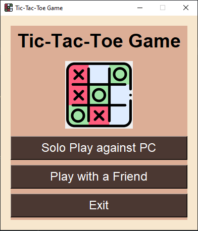
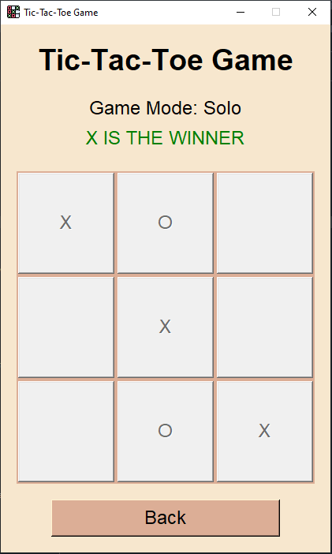

**Project name:**  
My Tic-Tac-Toe App

 
 

    
    

 
 

**Project Description:**  
This user-friendly app allows playing the classy Tic-Tac-Toe game with the computer (solo) or another player (multiplayer). 
Players take turns placing their X or O symbols on a 3x3 grid by clicking the cells. The app provides real-time feedback on the game's progress, 
announcing the winner or a tie when the game concludes. With its intuitive graphical interface and smooth gameplay, this tkinter Tic-Tac-Toe app 
offers an enjoyable way to challenge your friends and have some fun time."

**Libraries used:**
* tkinter
* random
* PIL

